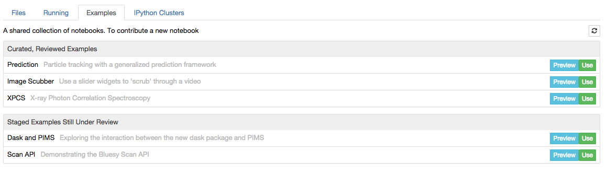
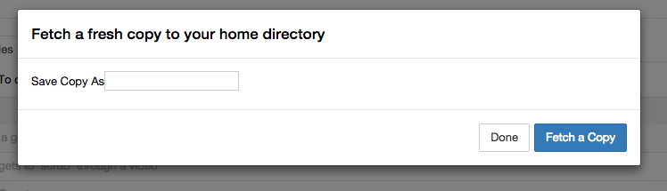
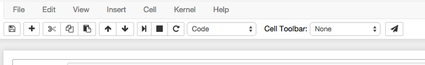

# nbexamples

This is a Jupyter extension that shows a list of example notebooks that users
can easily preview and copy for their own use.

The targeted application is a JupyterHub deployment, where it is useful to
distribute a collection of curated examples or templates and make it possible
for hub uses to quickly share examples.

A new "examples" page lists notebooks from some configured directory, showing
a title and description gleaned from notebook metadata. For each notebook
there are two buttons, "preview" and "use".

Examples are sorted into "reviewed," curated examples and "unreviewed"
examples.



Clicking "preview" shows a static HTML version of the notebook, optionally
including some example output.

Clicking "use" opens a dialog box to prompt user for a filename or filepath
(relative to their home dir).



On the notebook toolbar, a new "share as example" button (the "paper airplane"
icon at right) submits the notebook to the list of "unreviewed" examples.



Optionally, you can add a custom title and summary (as shown in the example)
by editing the notebook metadata (Edit > Edit Notebook Metadata) and adding
"title" and "summary" to the JSON. If these are not present, nbexamples
displays the notebook's filepath instead.

### URL scheme

* `/tree#examples` is the Examples tab on the user's home page
* `/examples` returns JSON that populates the contents of that tab
* `/examples/preview?example_id=xpcs.ipynb` shows a static HTML preview (similar to
  nbviewer)
* `/examples/fetch?example_id=xpcs.ipynb&dest=my-xpcs.ipynb` makes a "clean" copy of
  the notebook in the user's home directory, stripping out the example output
* `/examples/submit?example_id=my-new-example.ipynb` copies a notebook into a shared, globally-writable directory of "unreviewed" examples

### Requirements

* nbconvert
* nbformat

### Installation

```
python setup.py install
```

In addition to installing the `nbexamples` packages, the installation adds a
server extension to the jupyter notebook config file:

```python
c.NotebookApp.server_extensions.append('nbexamples.handlers')
```

### Configuration

Set the location of the example notebooks to be distributed by adding this
line to the jupyter notebook config file:

```python
c.Examples.reviewed_example_dir = '/opt/jupyter/examples/reviewed'
c.Examples.unreviewed_example_dir = '/opt/jupyter/examples/unreviewed'
```

The intention is that `unreviewed_examples` is a globally-writable directory.
Notebooks should be reviewed and promoted to `reviewed_examples` or
eventually purged.

### Related Work

This project is indebted to the [nbgrader](nbgrader.readthedocs.org) project,
a related (and much more complex!) application.
